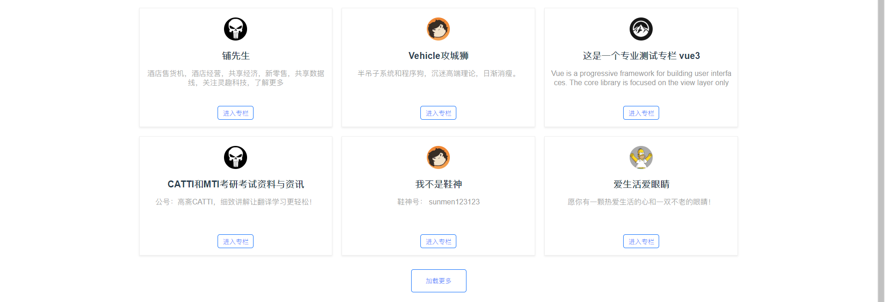
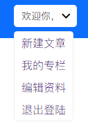

# vue-zhihu

一个仿知乎专栏的小 `demo` ，试图手写组件+样式，于是进度龟速。

- [vue-zhihu](#vue-zhihu)
  - [App页](#app页)
  - [首页](#首页)
  - [进度](#进度)
  - [Project setup](#project-setup)
    - [Compiles and hot-reloads for development](#compiles-and-hot-reloads-for-development)
    - [Compiles and minifies for production](#compiles-and-minifies-for-production)
    - [Customize configuration](#customize-configuration)

## App页

因为该 `demo` 所有页面的整体布局类似，都拥有一个 `header` 和一个 `footer`， 所以在 `App` 页面放置三个组件，`header` `footer` 和 `router-view`。

## 首页

默认路由指向的页面，不需要权限控制。简单拆分了几个小组件，展示用途的不提。
下方的专栏列表提一下样式问题。

需要让专栏列表的总宽度限制在一定范围内，例如 `1320px`， 每个专栏块占每一行的 `1/3`， 缩放时专栏也跟着缩小做到响应式。

可以选择使专栏外容器的 `max-width` 为我们需要的宽度，那么容器在小于这个宽度时会自动缩小。

再提一下子容器如何做到平分且固定为 `1/3`。

如果我们简单地使子容器宽度为 `33.33%`，然后父容器 `flex` 并且使子容器 `flex:1`, 其实在缩放时会出现问题。（问题出现在给子容器设置了外边距的情况下）

因为子容器是需要边距撑开彼此间距离的，但外边距的设置又会影响到 `flex` 排列导致一行无法被均分，子容器直接换行。

解决方法是给每个子容器包裹一个外层确定位置的标签，而边框线，内边距，上下边距直接在内部进行设置。而外层之间的间距靠内边距撑开，这样不会影响到行内布局，同时需要注意给盒子的 `box-sizing` 设置为 `border-box`。



点名提一下我的下拉列表😭

它长这样👇



样式，和插槽部分不提。

重点是一个 `hook` ,下拉列表有一个功能就是，当用户点开后点击到其他区域，需要将列表收起。

这样的点击事件需要注册在 `document` 上，那么就是在下拉列表组件加载后开始注册，然后在销毁组件时移除。

```js
import { onMounted, onUnMounted } from 'vue';
export default {
  setup() {
    const handler = (e) => {
      // 点击事件处理
      // if 当前绑定的下拉列表组件存在。
      // 判断 e.target 是否为下拉列表，并且此时下拉列表需要是显示状态。
      // 即控制下拉列表显示的变量需要为 true 。
      // 那么设置控制下拉列表显示的变量为 false 。
    }
    onMounted(() => {
      document.addEventListener('click', handler);
    });
    onUnmounted(() => {
      document.removeEventListener('click', handler);
    });
    return {
      handler
    }
  }
};
```

以上是在组件内部使用的示例，但实际上这些代码与视图模板并没有特别大的关系，可以抽取出来。给出一个是否点击其余位置的状态值，侦听这个值，改变时进行判断是否需要隐藏下拉列表。

```js
// src/hooks/useClickOutside.js
import { ref, onMounted, onUnmounted } from 'vue';
/**
 * useClickOutside 检测点击事件是否点击到目标dom对象之外。
 * @param {HTMLElement} elemRef 目标dom对象，此处特定为 vue.ref 的返回指
 */
const useClickOutside = elemRef => {
  const isClickOutside = ref(false);
  // 状态值，表示是否点击到外侧，默认为false
  /**
   * handler 点击事件的回调函数
   * @param {MouseEvent} e 鼠标点击事件对象
   */
  const handler = e => {
    // 传入的 dom 引用需要有值
    if (elemRef.value) {
      // 当前点击的 dom 元素是否包含在目标元素内，是的话则判定没有点击到外侧
      if (elemRef.value.contains(e.target)) {
        isClickOutside.value = false;
      } else {
        isClickOutside.value = true;
      }
    }
  };
  // 绑定点击事件
  onMounted(() => {
    document.addEventListener('click', handler);
  });
  // 移除点击事件
  onUnmounted(() => {
    document.removeEventListener('click', handler);
  });
  return isClickOutside;
};
export default useClickOutside;

```

此时将这个 `hook` 引入组件内，直接传入我们保存好的 `ref` 对象即可。

```js
const isClickOutside = useClickOutside(dropDownRef);
// 调用自定义函数得到检测点击的状态值。
watch(isClickOutside, () => {
// 侦听点击状态值，发生变化时判断是否需要更新下拉状态的显示。
  if (isMenuShow.value && isClickOutside.value) {
    isMenuShow.value = false;
  }
});
```

## 进度

- [x] 首页
- [ ] 登录
- [ ] 注册
- [ ] 个人信息
- [ ] 发布文章
- [ ] 用户专栏列表
- [ ] 文章详情页
- [ ] 权限控制
- [ ] 全局状态管理

## Project setup

```
npm install
```

### Compiles and hot-reloads for development

```
npm run serve
```

### Compiles and minifies for production

```
npm run build
```

### Customize configuration

See [Configuration Reference](https://cli.vuejs.org/config/).
